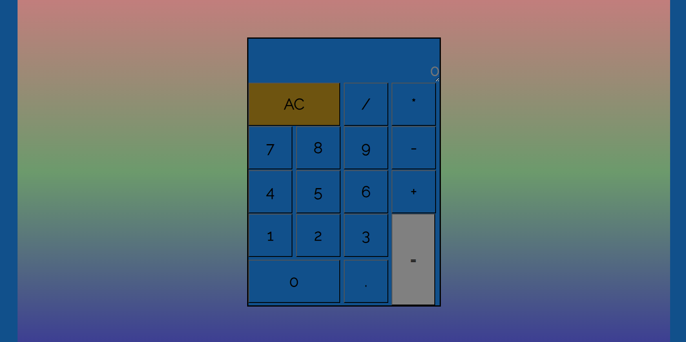

# Meeting Mr. Calculator

## Intro.
- Like any functional calculator, and like any programing novice, the calculator is built utilizing HTML, CSS and Javascript. 
- SASS/CSS:
   - uses decorations with grid systems; 
- JS: 
   - mainly manipulates the DOM. 
- Since the app addresses on its accuracy, doing sanitizing all user inputs was a demanding task. Great work!
##  Preview

